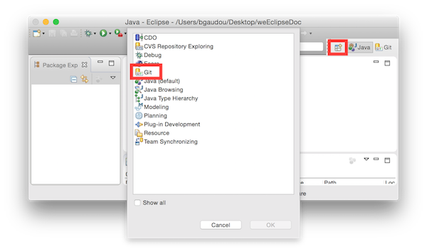
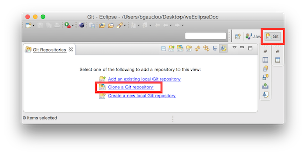
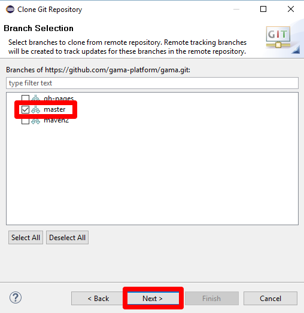
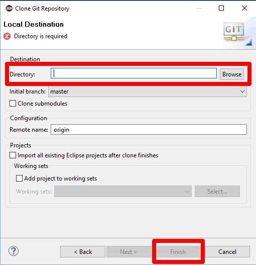
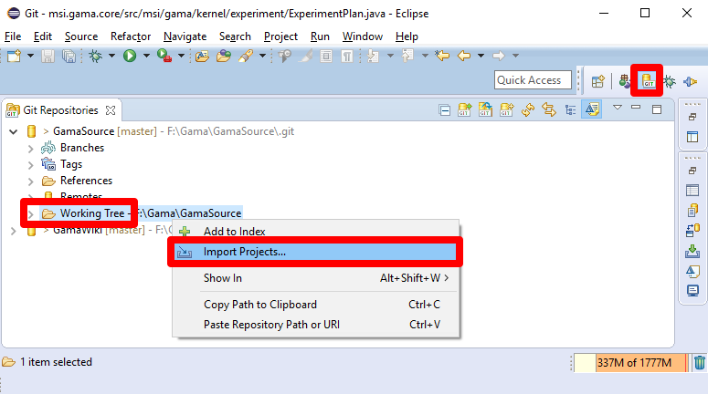
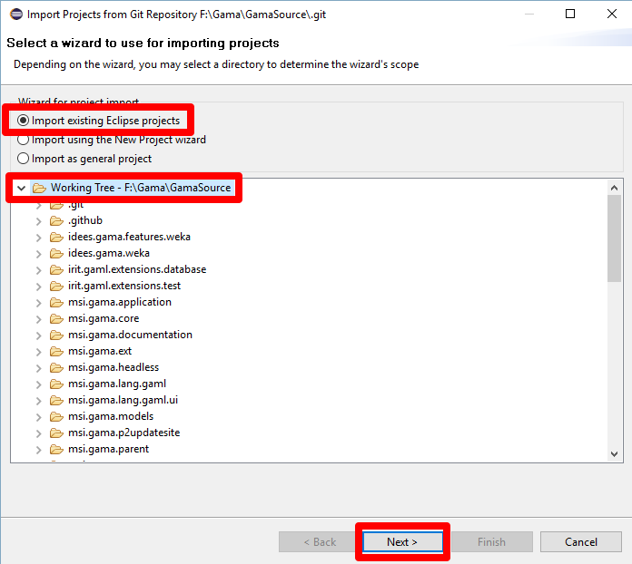
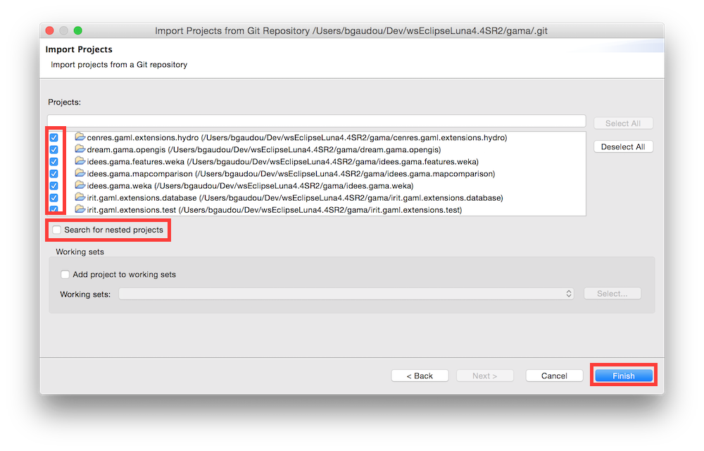

# Installing the GIT version

Tested on MacOS X (10.9 to 10.11), Windows (8 to 10) and Ubuntu 15.04 (Vivid)

_Important note: the current Git version is **not** compatible with the GAMA 1.6.1 release: if you plan to create plugins for this release, please download the source at revision r11988 (on Google Code) and [Eclipse following this procedure](InstallingSvnOldVersions)_

## Install Eclipse Mars SR2

Download the ["Eclipse IDE for Java and DSL Developers"](http://www.eclipse.org/downloads/packages/eclipse-ide-java-and-dsl-developers/mars2) version (If Java is not installed on your computer you can download it [here](http://www.oracle.com/technetwork/java/javase/downloads/index.html)). 

Unpack it and launch it. Please refer to this [link](http://help.eclipse.org/mars/index.jsp?nav=%2F0) for more information on running Eclipse.

**One important step** required for GAMA to correctly produce its supporting files once it will have been installed is to set the default encoding of the workspace to UTF-8. It can be done by selecting, in the Preferences, "General", then "Workspace", then "Text file encoding" and choosing "UTF-8" in the drop-down menu available in "Other:".

## Install GAMA source code

The source is to be downloaded from GitHub in two steps: by creating a local clone of the GitHub repository and then importing the different projects that constitute GAMA into the Eclipse workspace.

1. Open the Git perspective:
  * Windows > Perspective > Open Perspective > Other...
  * Choose `Git`

2. Click on "Clone a Git repository"

  * In **Source Git repository** window: 
    * Fill in the URI label with: `https://github.com/gama-platform/gama.git`
    * Other fields will be automatically filled in.
    
  * In **Branch Selection** windows, 
    * check the master branch 
    * Next
    * Note: If you are using Ubuntu 16 and you did not find any branch in this windows, may be your eclipse has a bug related with the OS. The workaround should be: 
        * Close eclipse
        * Open eclipse.ini
        * Add these 2 lines before **--launcher.appendVmargs**:

        --launcher.GTK_version   
        2
        * Change required version of java from : -Dosgi.requiredJavaVersion=1.7 into -Dosgi.requiredJavaVersion=1.8
        * Remove this line: -XX:MaxPermSize=256m
        * Save and close eclipse.ini
        * Start eclipse and redo from step 1

  * In **Local Destination** windows,
    * Choose a Directory (where the source files will be downloaded).
    * Everything else should be unchecked 
    * Finish

This can take a while...

### Import projects into workspace
You have now to import projects into the workspace (notice that the folders downloaded during the clone will neither be copied nor moved).

1. In the **Git perspective** and the **Git Repositories** view, Right-Click on "Working Tree" inside the `gama` repository, and choose "Import projects"

  * In the **Select a wizard to use for importing projects** window:
    * "Import existing projects" should be checked
    * "Working Tree" should be selected
    
  * In **Import Projects** window:
    * **Uncheck « Search for nested project »**
    * Check the projects you want to import
    * Finish

2. Go back to the Java perspective
3. Clean project (Project menu > Clean ...)

### If you have errors...
If errors continue to show on in the different projects, be sure to correctly set the JDK used in the Eclipse preferences. GAMA is targeting JDK 1.8, and Eclipse will produce errors if it not found in your environment. So, either you set the compatibility to 1.8 by default (in Preferences > Java > Compiler > Compiler Compliance Level) or you change the error produced by Eclipse to a warning only (in Preferences > Java > Compiler > Building > "No strictly compatible JRE for execution environment available).

### Run GAMA
1. In the `ummisco.gama.product` plugin, open the `gama.runtime.product` file (`gama.product` is used to produce the release).
2. Go to "Contents" tab and click on "Add required"
3. Go to "Overview" tab and click on Synchronize
4. Click on Launch an Eclipse Application

###GIT Tutorials
For those who want learn more about Git and Egit, please consult the following tutorials/papers

1. EGIT/User Guide http://wiki.eclipse.org/EGit/User_Guide
2. Git version control with Eclipse (EGIT) - Tutorial http://www.vogella.com/tutorials/EclipseGit/article.html
3. 10 things I hate about Git http://stevebennett.me/2012/02/24/10-things-i-hate-about-git/
4. Learn Git and GitHub Tutorial https://www.youtube.com/playlist?list=PL1F56EA413018EEE1
